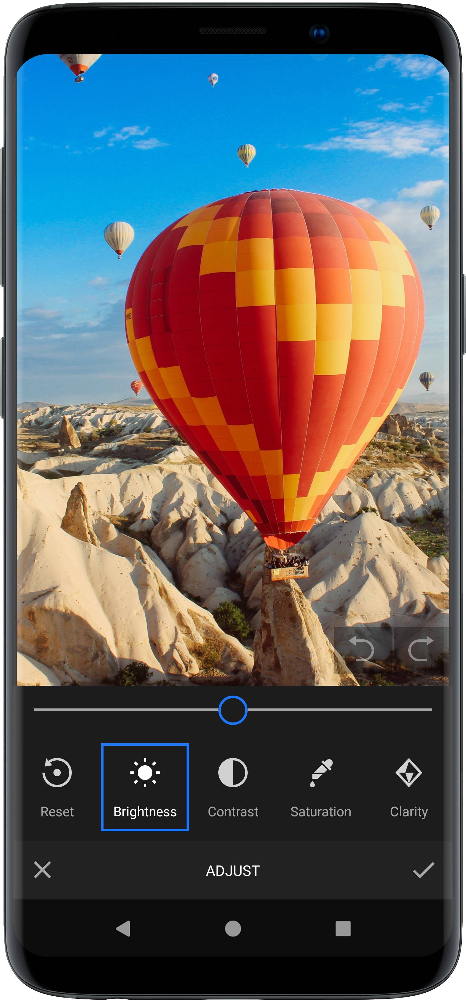

<!-- ------------------------------------------------------- --|
 |-- ------------------------------------------------------- --|
 |-- ----This file is automatically generated by groovy.---- --|
 |-- Do not modify this file -- YOUR CHANGES WILL BE ERASED! --|
 |-- ------------------------------------------------------- --|
 |-- ------------------------------------------------------- -->

    

  
  
  
  

# Seamlessly integrate video creation into your Android applications
[VideoEditor SDK](https://img.ly/video-sdk/?utm_campaign=Projects&utm_source=Github&utm_medium=VESDK&utm_content=Android) expands the powerful tools and features of the PhotoEditor SDK into the realm of mobile video creation.

With an intuitive UI, an extensive filter gallery, advanced adjustment tools and crops for social aspect ratios you’ll empower your users to create engaging and professional looking videos in a breeze.
  

    

 

## Features

### Adjustments

    

The Adjustment section holds a variety of handy tools for your users to tweak and fine tune their footage ranging from basic operations like brightness and contrast to more sophisticated options like gamma.

### Trimming

The trimming tool helps your users to keep their content relevant and get rid of unnecessary or boring parts. With a simple drag of the playhead your users can limit their footage to the most interesting parts only.

### Filters

The VideoEditor SDK ships with over 60 filters for every mood and atmosphere. Let your users achieve a cinematic look for their videos with a single tap.

### Transform

Let your users present their content in the most fitting format. The Transform section unifies cropping, flipping and rotating operations. The SDK ships with various preset crop and aspect ratios like 1:1, 16:9, and common social media formats.

### Furnish

The VideoEditor SDK offers various handy tools to spice up and furnish video content for maximum effect. With Stickers, Frames, Overlays and a Brush tool your users can easily turn any video into a successful social media post.

### Communicate

A compelling message adds the final touch to any video. The VideoEditor SDK provides all necessary functions for quickly adding and editing text. Furthermore: The Text Design tool automatically merges input text with typography layouts to create stunning designs.

## License Terms
Make sure you have a commercial license before releasing your app. A commercial license is required for any app or service that has any form of monetization: This includes free apps with in-app purchases or ad supported applications. Please contact us if you want to purchase the commercial license.

## Support and License
Use our [service desk](https://support.img.ly) for bug reports or support requests. To request a commercial license, please use the [license request](https://img.ly/pricing?product=vesdk&?utm_campaign=Projects&utm_source=Github&utm_medium=VESDK&utm_content=Android) form on our website.
